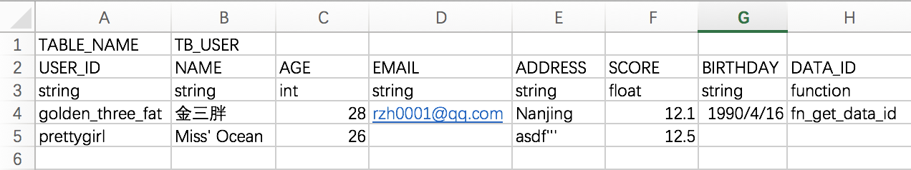

# Excel2SQL
This script will generate insert sql accroding to the config and data in the excel file

## Requirements
+ Python
+ xlrd  (`pip install xlrd`)

## Usage
> python excel2SQL.py excel\_file sheet\_index

args| description
----|----
excel_file| if excel file and excel2SQL.py are in the same directory excel file path, it can be excel file name, otherwise it should be absolute path 
sheet_index| excel worksheet index

## Excel config
  
Line 1: TABLE\_NAME  
Line 2: COLUMN\_NAME  
Line 3: COLUMN\_TYPE  

type | value  | result in sql
----|----  | ----
string| grettygirl|  values ('grettygirl')
int		| 28	| values (28)
float	| 12.1	| values (12.1)
function	| fn\_get\_data\_id	| select fn\_get\_data\_id from dual

Line 4: data

## Example
```
INSERT TB_USER (USER_ID, NAME, AGE, EMAIL, ADDRESS, SCORE, BIRTHDAY, DATA_ID ) SELECT 'golden_three_fat', '金三胖', 28, 'rzh0001@qq.com', 'Nanjing', 12.1, '19900416', fn_get_data_id FROM DUAL;
```
